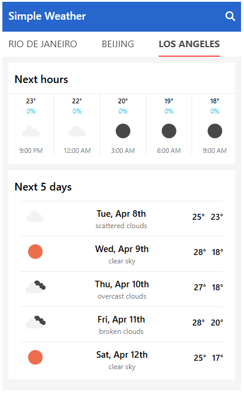

# Simple Weather App

## Getting Started

After cloning the repository `git clone https://github.com/BrendaQu/simple-weather-app.git`

Update the `VITE_WEATHER_API_KEY` in .env file with API key.

Run the following commands to spin up app.

```
npm install
npm run dev
```

## Project Overview

Simple weather app will display Next Hours forecast and Next 5 days forecast for the following three cities: Rio de Janeiro, Beijing, and Los Angeles. Tabbing through each city will refresh the data.

